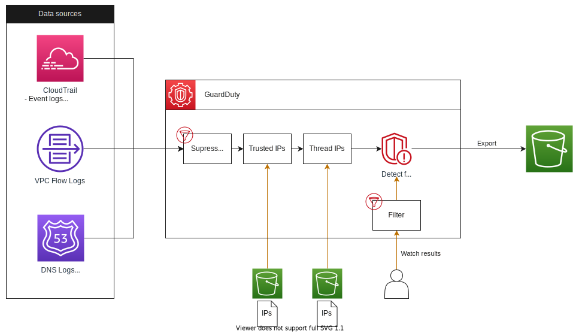

# Minimum example of Terraform - Amazon Guard Duty

## Architecture


## Code structure
```
terraform
├── env
│   └── example
│       ├── main.tf
│       └── providers.tf
└── module
    └── guardduty
        ├── data.tf
        ├── detector.tf
        ├── export.tf
        ├── filters.tf
        ├── thread_ips.tf
        └── trusted_ips.tf
```
